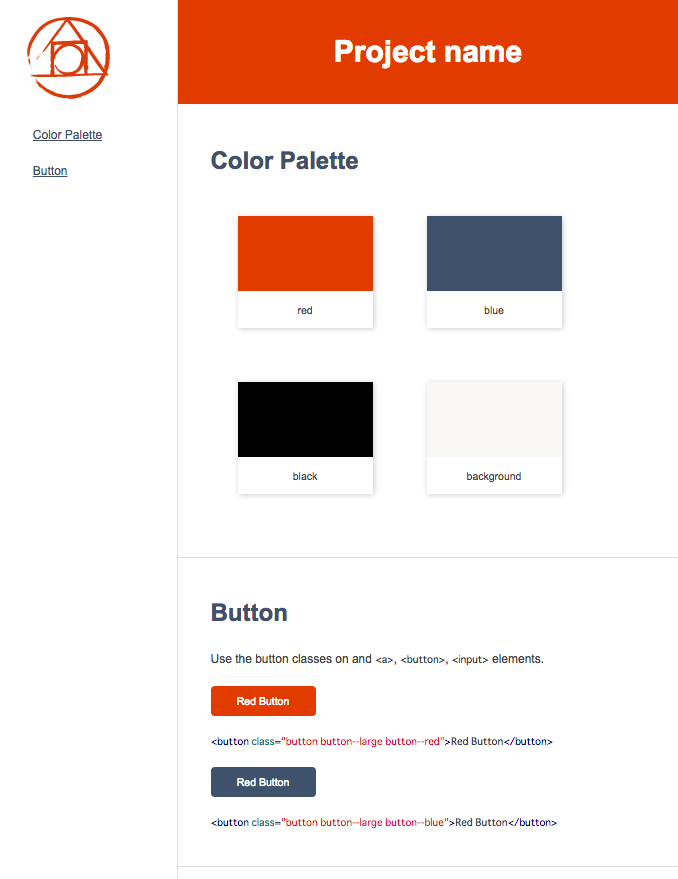

# psg-theme-default [](https://travis-ci.org/morishitter/psg-theme-default)

Default theme of [postcss-style-guide](https://github.com/morishitter/postcss-style-guide)

## Install

```shell
$ npm install psg-theme-default
```

## Theme



## License

The MIT License (MIT)

Copyright (c) 2015 Masaaki Morishita
